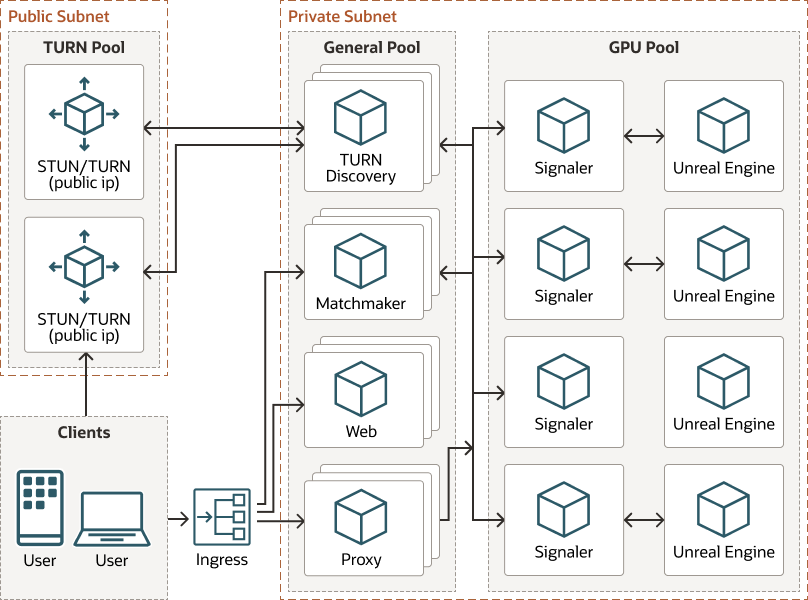

# Unreal Pixel Streaming on OKE

This project represents a scalable pixel streaming deployment on Oracle
Container Engine for Kubernetes (OKE). It is built intentionally using
the simplest constructs and/or dependencies with minimal customizations
to original samples from Epic Games

## Architecture

## Services

| Service | About |
|--|--|
| [signalserver](./src/signalserver) | Unreal "Cirrus" signal server with extensions |
| [matchmaker](./src/matchmaker) | Unreal "Matchmaker" server with extensions |
| [player](./src/player) | Unreal sample player (web) service with modifications |
| [proxy](./src/proxy) | NGINX reverse proxy for individual streamer API interactions |
| [router](./src/router) | Traefik proxy router (ingress) |
| [turn](./src/turn) | coTURN daemonset for STUN/TURN |
| [turn-api](./src/turn-api) | `turn` pool WebRTC configuration discovery/aggregator |
| - | - |
| [kubetools](./src/kubetools) | Container for sidecar/init `kubectl` utilities in cluster |
| [unreal](./src/unreal) | Sample `Dockerfile` for an Unreal Pixel Streaming projects |

## About WebRTC

WebRTC defines a web peering technology for real-time media and data streaming.
To establish the peer-to-peer connection, WebRTC uses a four-way handshake where
the various peer networking configurations and firewalls are traversed. The basic
design of a WebRTC system includes the following:

- A **signalling** service that establishes an initial connection with the streaming application and exchanges **Interactive Connectivity Establishment** (ICE) candidate configurations.
- Session Traversal Utilities for NAT (STUN) and Traversal Using Relays around NAT (TURN) servers which
provide ICE candidates to the signal service
- A Session Description Protocol network path is discovered through ICE negotiation and the peer-to-peer connection is created.
- STUN/TURN server transports the encoded media stream between the streaming app and browser.

## Telemetry

GPU Telemetry is done through the use of prometheus and the DCGM exporter. Setup and configuration
details can be found in the [NVIDIA Documentation][nvidia-gpu-telemetry]

## Scaling

### Prometheus Adapter

In order to acheive the desired autoscaling scenario of reactive
scaling the GPU streaming application, it is necessary
to leverage the [Prometheus Adapter](https://github.com/kubernetes-sigs/prometheus-adapter) with custom metrics on the streamer Horizontal Pod Autoscaler.

Each signal server produces a metric that indicates whether or not (1 or 0)
its stream is allocated to a client. By scaling on this metric with a target
total value of `1`, the replicaset will be adjusted to hit this goal. It's worth
noting that the GPU pool/shape should be chosen such that cluster autoscaling
happens infrequently enough as not to impact the user experience.

## Assumptions and Limitations

This architecture is partially based on original sample code from Epic Games
to support Unreal Engine Pixel Streaming (signalserver and matchmaker).
There are some associated limitations with those services, many of which are
described [here](https://tensorworks.com.au/blog/an-open-architecture-for-scalable-pixel-streaming/),
as well as some introduced by this design. This section is meant to call attention
to some known shortcomings that may require additional work.

- Authentication is not included. Users should consider adding upstream auth,
  or extending the [router](../src/router/) configurations.
- Streamer availability is done via broadcast to matchmaker rather than using
  service discovery from endpoints.
- Player websocket connections are queued through matchmaker and forwarded to
  matched streams.
- Matchmaker replicas do not share state, therefore stream availability and
  player session affinity may be unpredictable.
- Each WebRTC session establishes a peer-to-peer mesh, so the number of
  connections is n2 where `n` is the number of participants.
- The static browser code in [`src/player`](../src/player/) is mostly original,
  but slightly adapted for this runtime. It is meant purely as a starting point,
  however is not a model for modern web apps.
- The demo applies some defaults to the pixel streaming runtime, including
  a maximum 30 frames per second value. This is an arbitrary selection for demo
  performance, and may be adjusted in the env [ConfigMap](./base/streaming/config/pixel.properties).
  Refer to [documentation](https://docs.unrealengine.com/4.27/en-US/SharingAndReleasing/PixelStreaming/PixelStreamingReference/).

### GPU Allocation

- Containers (and Pods) _normally_ do not share GPUs - as in, there's no
  overcommitting of GPUs. Each container can request one or more GPUs, but it
  is not possible to request a fraction of a GPU.
  - This demo uses the `app.pixel/gpu` label for affinity and proportionate CPU requests to
    allow more than one stream on a single GPU, which may not be suitable in production.
    > See [stream-runtime.yaml](./base/streaming/stream-runtime.yaml#L125) for more information.
- [MIG Support][mig-k8s] (multi-instance GPU partitioning) will require testing with A100 shapes,

## References

Below is a list of helpful references with concepts applied within this
architecture

| Link                                                                                                                 | About                                                                                                                                        |
| -------------------------------------------------------------------------------------------------------------------- | -------------------------------------------------------------------------------------------------------------------------------------------- |
| [Trickle ICE](https://webrtc.github.io/samples/src/content/peerconnection/trickle-ice/)                              | Tests STUN/TURN                                                                                                                                                                                                                                                            |
| [UE4 Containers](https://docs.unrealengine.com/4.27/en-US/SharingAndReleasing/Containers/ContainersOverview/)        | Unreal Engine official docs on general container usage                                                                                       |
| [unrealcontainers.com](https://unrealcontainers.com/docs/use-cases/pixel-streaming)                                  | resource created by Adam Rehn - AKA God of Unreal running in Linux/Containers                                                                |
| [Unreal Engine Images](https://github.com/orgs/EpicGames/packages/container/unreal-engine/versions)                  | requires permissions with Epic Games, but this is where the `ghcr.io` base images from Unreal live                                           |
| [Unreal Image EULA](https://unrealcontainers.com/docs/obtaining-images/eula-restrictions)                            | Information on how Unreal Engine EULA restricts the distribution of Unreal Engine container images                                           |
| -                                                                                                                    |                                                                                                                                              |
| [NVIDIA containers][nvidia-containers]                                                                               | Information from NVIDIA on GPUs in cloud native                                                                                              |
| [NVIDIA GPU Monitoring][nvidia-gpu-telemetry]                                                                        | How to collect GPU metrics for prometheus in k8s (Data Center GPU Metrics exporter)                                                          |
| [GPU Monitoring Tools][gpu-monitoring-tools]                                                                         | Helm charts for GPU Telemetry                                                                                                                |
| [MIG Support][mig-k8s]                                                                                               | Multi-instance GPU partitioning support (NVIDIA A100)                                                                                        |
| [Oracle GPU](https://www.oracle.com/cloud/partners/gpu.html)                                                         | Oracle Cloud Infrastructure NVIDIA GPU Instances                                                                                             |

<!-- links -->
[mig-k8s]:https://docs.nvidia.com/datacenter/cloud-native/kubernetes/mig-k8s.html
[nvidia-containers]:https://docs.nvidia.com/datacenter/cloud-native/
[nvidia-gpu-telemetry]:https://docs.nvidia.com/datacenter/cloud-native/gpu-telemetry/dcgm-exporter.html#gpu-telemetry
[gpu-monitoring-tools]:https://nvidia.github.io/gpu-monitoring-tools/

[coturn]:https://github.com/coturn/coturn
[pion-turn]:https://github.com/pion/turn
[dcgm-exporter-dashboard]:https://grafana.com/grafana/dashboards/12239
[cluster-autoscaling]:https://docs.oracle.com/en-us/iaas/Content/ContEng/Tasks/contengusingclusterautoscaler.htm

## Resources

- [Oracle GPU](https://www.oracle.com/cloud/partners/gpu.html)
- [Pixel Streaming](https://docs.unrealengine.com/4.27/en-US/SharingAndReleasing/PixelStreaming/)
- [Matchmaking](https://docs.unrealengine.com/4.26/en-US/SharingAndReleasing/PixelStreaming/Hosting/#multiplefullstackswithmatchmaking)
- [Unreal Containers](https://unrealcontainers.com/docs/use-cases/pixel-streaming)
- [PS in Linux containers](https://adamrehn.com/articles/pixel-streaming-in-linux-containers/)
- [ue4-docker CLI](https://github.com/adamrehn/ue4-docker)
- [coTURN](https://github.com/coturn/coturn)
- [NVIDIA GPU Monitoring](https://docs.nvidia.com/datacenter/cloud-native/gpu-telemetry/dcgm-exporter.html#gpu-telemetry)

## License

Copyright (c) 2021, 2022 Oracle and/or its affiliates.
Released under the Universal Permissive License (UPL), Version 1.0.
See [LICENSE](./LICENSE) for more details.
