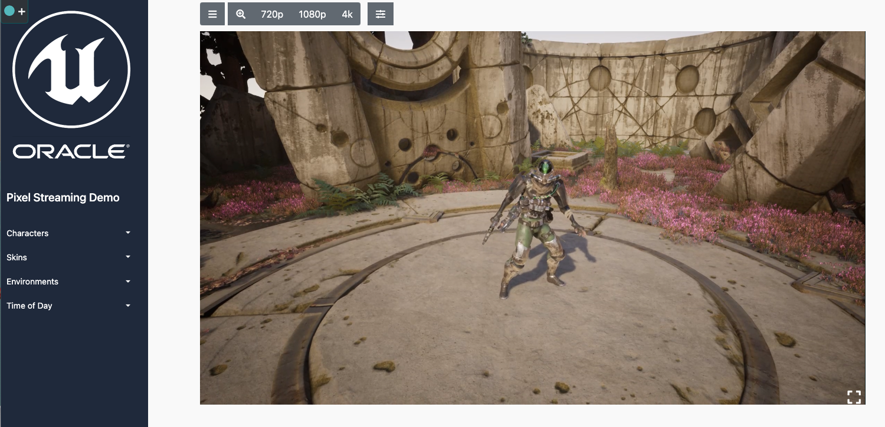

# Unreal Engine 5 PixelStreaming with OKE and Nvidia A10 Tensor Core GPU

Welcome to this hands-on lab, where you will learn how to create a Kubernetes cluster with a GPU node pool and deploy an Unreal Pixelstreaming demo.

In this lab, we will be using Kubernetes, an open-source container orchestration platform, to manage our cluster of nodes.

We will be creating a GPU node pool to enable us to run pixel streaming workloads on the cluster. Pixel streaming is a technology that enables you to stream high-quality 3D graphics over the internet.

## Architecture

*Please proceed to the next lab*