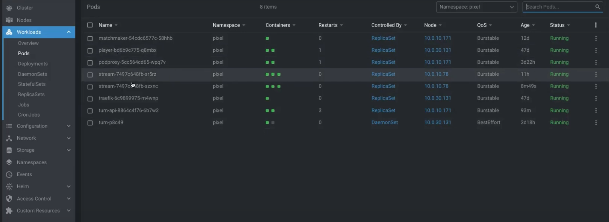
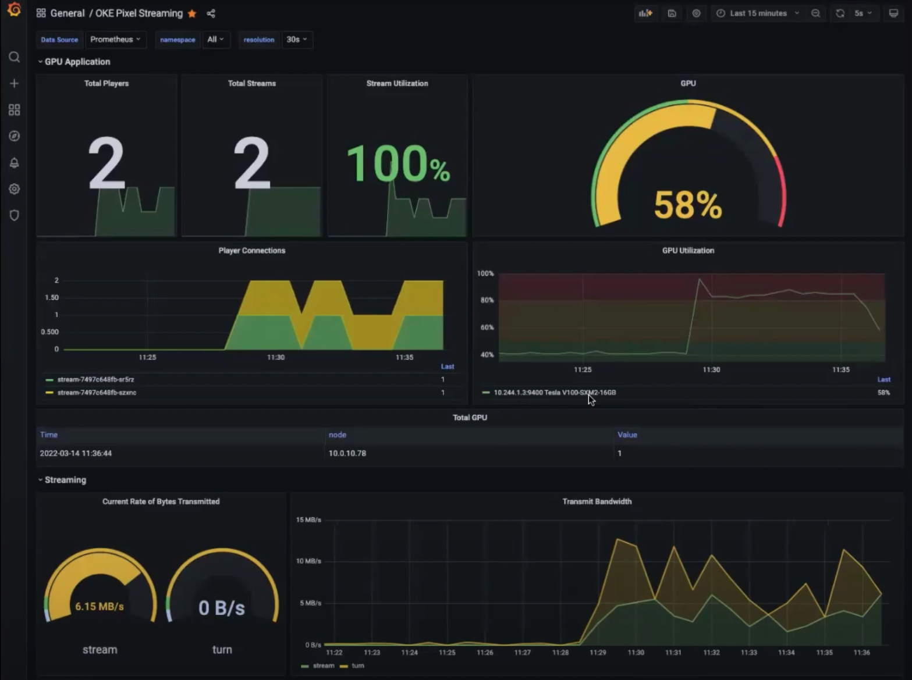

# Telemetry


## Introduction
GPU Telemetry is done through the use of prometheus and the DCGM exporter.

### Objectives
- Enable monitoring and telemetry
- Access dashboards to gain insights about our cluster

## Task 1: Install Prometheus Stack
A values file for the prometheus stack is provided with settings to include GPU metrics from dcgm-exporter. These values are unmodified from the nvidia installation guide

```bash
<copy>helm upgrade --install prometheus-stack kube-prometheus-stack \
  --repo https://prometheus-community.github.io/helm-charts \
  --namespace prometheus --create-namespace \
  --values ./support/prometheus.values.yaml \
  --set prometheus.prometheusSpec.serviceMonitorSelectorNilUsesHelmValues=false</copy>
```

## Task 2:Add DCGM Exporter
Although prometheus has been installed, it won't collect any GPU metrics until the Data Center GPU Manager exporter is deployed which exposes the metrics endpoint scraped by prometheus. Again, a custom values file is defined to ensure the DaemonSet is properly deployed on GPU nodes.

```bash
<copy>helm upgrade --install dcgm-exporter dcgm-exporter \
  --repo https://nvidia.github.io/dcgm-exporter/helm-charts \
  --namespace prometheus \
  --values ./support/dcgm.values.yaml</copy>
```
The values applied for this helm chart release are specific to this use case:

Establish known gpu node selections
```
nodeSelector:
  app.pixel/gpu: "true"
```

ensure scheduling is allowed based on OKE GPU node taints
```
tolerations:
  - key: "nvidia.com/gpu"
    effect: "NoSchedule"
    operator: "Exists"
```

## Task 3: Access Grafana



Grafana is installed automatically as part of the kube-prometheus-stack chart. The installation is pre-loaded with several useful kubernetes dashboards. In order to see GPU metrics, we'll add a dashboard related specifically to the dcgm-exporter metrics.

Get the grafana admin password:

```bash
<copy>kubectl get secret prometheus-stack-grafana \
  -n prometheus \
  -o jsonpath="{.data.admin-password}" | base64 --decode; echo</copy>
```
The admin account password defaults to prom-operator in the prometheus helm chart

In order to access the grafana user interface, you can enable ingress through the kube-prometheus-stack grafana settings or define it separately.

Based on the prometheus installation, the grafana service will be named prometheus-stack-grafana. For now, simply open a local port-forward on to the service and load the dashboard.

```
<copy>kubectl port-forward svc/prometheus-stack-grafana -n prometheus 8000:80</copy>
```

TODO: import relevant dashboards:


*Please proceed to the next lab*

## Acknowledgements

- **Author** - Kay Malcolm, Director, Product Management
- **Adapted by** -  Yaisah Granillo, Cloud Solution Engineer, NA Cloud
- **Contributors** - LiveLabs QA Team (Arabella Yao, Product Manager Intern | Isa Kessinger, QA Intern)
- **Last Updated By/Date** - Kay Malcolm, October 2020
